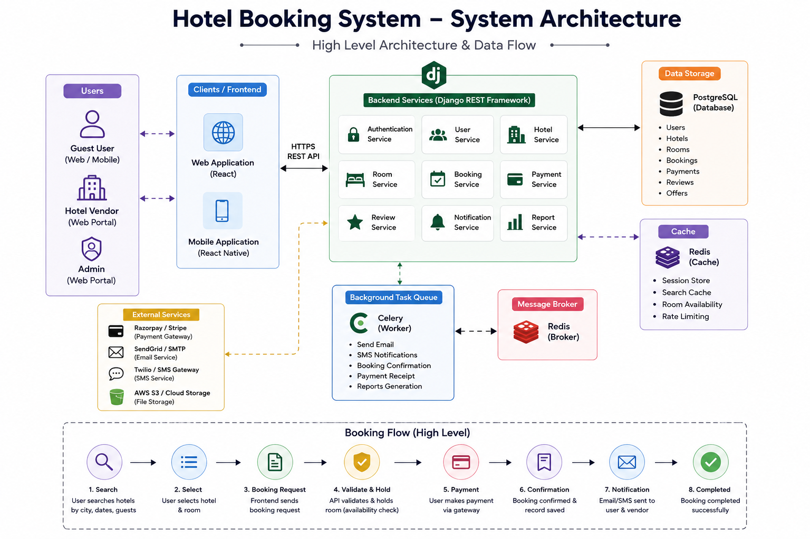

# Navgurukul_prework
# Hotel Booking System

A scalable backend-driven Hotel Booking System developed using **Python, Django, and Django REST Framework**.

The platform allows users to:
- Search hotels
- Check room availability
- Create bookings
- Make secure payments
- Manage reservations
- Receive booking confirmations

The project was designed with a focus on:
- Scalable backend architecture
- Secure REST APIs
- Optimized database queries
- Real-time booking management
- Asynchronous task processing

---

# Project Overview

This project was developed to simulate a real-world hotel booking platform where users can search hotels, view rooms, create bookings, process payments, and manage reservations through secure REST APIs.

The backend system was designed to handle:
- Authentication
- Booking workflows
- Room availability management
- Payment integration
- Vendor management
- Admin operations

My primary responsibility was developing backend APIs, implementing business logic, authentication workflows, booking operations, and database optimization.

---

# Features

 User Registration & Login  
 JWT Authentication  
 Hotel Search & Filtering  
 Room Availability Check  
 Booking Creation & Management  
 Payment Gateway Integration  
 Vendor & Admin APIs  
 Async Email Notifications  
 Redis Caching  
 Celery Background Tasks  
 Optimized Database Queries  

---

# Technologies Used

| Technology | Purpose |
|---|---|
| Python | Backend Development |
| Django | Web Framework |
| Django REST Framework | REST API Development |
| PostgreSQL | Relational Database |
| Redis | Caching & Queue |
| Celery | Background Task Processing |
| JWT Authentication | Secure API Authentication |
| Razorpay / Stripe | Payment Gateway |
| AWS S3 | File Storage |
| React | Frontend Integration |

---

# Primary Technical Challenges

During development, the major technical constraints were:

- Preventing duplicate room bookings during concurrent requests
- Maintaining fast API response time during hotel searches
- Securing APIs for frontend and mobile clients
- Handling asynchronous operations efficiently
- Optimizing database queries for large hotel datasets

---

# System Architecture

## High-Level Architecture

The frontend communicates with backend REST APIs built using Django REST Framework over HTTPS.

The backend handles:
- Authentication
- Booking Logic
- Room Availability Validation
- Payment Processing
- Vendor & Admin Operations

PostgreSQL is used as the primary database, while Redis and Celery are used for asynchronous task processing such as booking confirmation emails and notifications.

The system was designed in a modular architecture so that each component could scale independently.

---

# Architecture Diagram



---

# Architecture Explanation

## Frontend Layer

The frontend handles:
- Hotel Search
- Room Listing
- Booking Management
- Payment Flow

The frontend communicates with backend APIs using:
- JSON requests
- JWT authentication

---

## Backend Layer (Django REST Framework)

The backend handles:
- Business Logic
- Authentication
- Booking APIs
- Validation
- Payment Integration
- Vendor Management

REST APIs were implemented using:
- ViewSets
- Serializers
- JWT Authentication
- ORM Optimization Techniques

---

## Database Layer

PostgreSQL stores:
- Users
- Hotels
- Rooms
- Bookings
- Payments
- Reviews

Database indexing and optimized ORM queries were implemented to improve performance.

---

## Async Processing Layer

Redis and Celery were used for:
- Email Notifications
- Booking Confirmation Processing
- Background Tasks

This significantly reduced API response time because long-running operations were moved outside the request-response cycle.

---

# Booking Flow (End-to-End)

1. User searches hotels from frontend
2. Frontend sends booking request to backend
3. JWT token gets validated
4. Backend checks room availability
5. Booking record stored in PostgreSQL
6. Payment status updated
7. Celery task triggered
8. Redis queue processes async task
9. Confirmation email sent to user
10. Success response returned to frontend

---

# JWT Authentication

JWT Authentication was selected because frontend and backend were developed separately, and JWT works efficiently for stateless API authentication.

## Advantages

- Stateless authentication
- Better scalability
- Frontend-friendly
- Secure API communication

## Trade-offs

- Token revocation handling becomes difficult
- Token expiration requires additional handling

Despite these trade-offs, JWT was the best fit for scalable REST API architecture.

---

# Critical API Walkthrough – Booking Creation API

One of the most important APIs in the project was the booking creation API because multiple users could attempt booking the same room simultaneously.

## Booking Flow Logic

- Authenticate user using JWT token
- Validate request payload
- Check room availability
- Create booking record
- Store payment status
- Trigger async confirmation email
- Return booking confirmation response

---

# Sample Booking API

```python
from rest_framework.response import Response
from rest_framework import status

def create_booking(request):

    user = request.user
    room_id = request.data.get("room_id")

    room = Room.objects.get(id=room_id)

    # Check room availability
    if not room.is_available:
        return Response(
            {"message": "Room not available"},
            status=status.HTTP_400_BAD_REQUEST
        )

    # Create booking
    booking = Booking.objects.create(
        user=user,
        room=room,
        status="CONFIRMED"
    )

    # Trigger async email notification
    send_booking_email.delay(user.email)

    return Response(
        {
            "message": "Booking successful",
            "booking_id": booking.id
        },
        status=status.HTTP_201_CREATED
    )
```

---

# Why This API Was Important

This API was critical because:
- Multiple users could book simultaneously
- Booking consistency had to be maintained
- API response time needed to remain fast
- Payment and booking status had to stay synchronized

To solve these challenges, the project focused on:
- Proper validation
- Optimized database access
- Async processing using Celery & Redis

---

# Redis & Celery Background Tasks

Initially, email notifications were processed synchronously inside APIs, which increased API response time.

To improve performance, Redis and Celery were implemented for asynchronous task execution.

## Background Tasks Included

- Email Notifications
- Booking Confirmation Processing
- Queue Management
- Payment Notifications

## Benefits

- Faster API responses
- Better scalability
- Improved user experience
- Reduced request blocking

---

# Performance Optimization

As the number of hotels and bookings increased, the hotel search API started becoming slower due to repeated database queries.

## Optimization Techniques Used

- Database Indexing
- Optimized ORM Queries
- `select_related()`
- `prefetch_related()`
- Redis Caching
- Pagination for large datasets

These optimizations significantly reduced unnecessary database hits and improved API response time.

---

# Technical Decisions

## Decision 1 – JWT Authentication

### Alternatives Considered
- Django Session Authentication
- OAuth Authentication

### Why JWT Was Selected

Advantages:
- Stateless architecture
- Better scalability
- Easy frontend integration

Trade-offs:
- Token revocation handling
- Token expiration management

---

## Decision 2 – Redis & Celery for Background Tasks

### Alternatives Considered
- Python Threading
- Direct Synchronous Execution

### Advantages

- Faster API responses
- Async task execution
- Better scalability

### Trade-offs

- Additional infrastructure setup
- Queue monitoring required

This significantly improved overall backend performance.

---

# Learning & Refactoring

## Technical Mistake

Initially, too much business logic was written directly inside API views, which made the project difficult to maintain and debug.

Later, the project was refactored into:
- Serializers
- Service Layers
- Utility Modules
- Reusable Helper Functions

This improved:
- Code readability
- Scalability
- Maintainability
- Testing capability

This experience helped me understand the importance of clean architecture and separation of concerns.

---

# Future Improvements

If rebuilding the project today, the following improvements would be added:

- Docker-based deployment
- Kubernetes orchestration
- Centralized logging
- Monitoring dashboards
- API rate limiting
- CI/CD pipelines
- Stronger automated testing

These improvements would make the system more production-ready and scalable for high-traffic environments.

---


```
